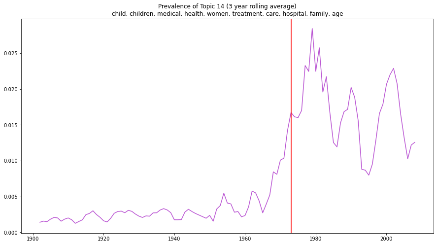
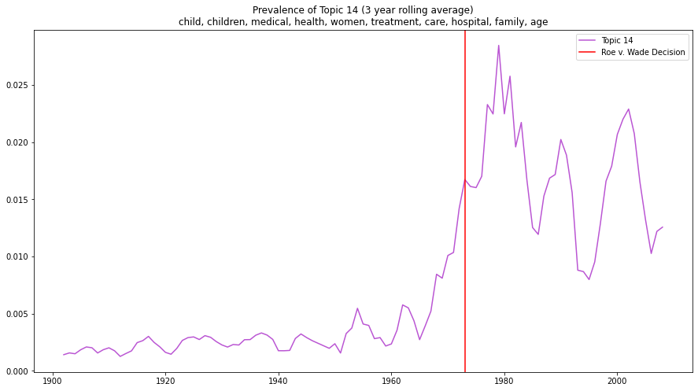

```python
import os
import gzip
import pandas as pd
import numpy as np
```


```python
with gzip.open('../datasets/supreme-court-opinions-by-author.jsonl.gz', 'rt') as fh:
    df = pd.read_json(fh, lines=True).set_index(['us_reports_citation', 'authors'])
df.loc['410 US 113']
```


<div>
<style scoped>
    .dataframe tbody tr th:only-of-type {
        vertical-align: middle;
    }

    .dataframe tbody tr th {
        vertical-align: top;
    }

    .dataframe thead th {
        text-align: right;
    }
</style>
<table border="1" class="dataframe">
  <thead>
    <tr style="text-align: right;">
      <th></th>
      <th>case_id</th>
      <th>text</th>
      <th>type</th>
      <th>year</th>
    </tr>
    <tr>
      <th>authors</th>
      <th></th>
      <th></th>
      <th></th>
      <th></th>
    </tr>
  </thead>
  <tbody>
    <tr>
      <th>blackmun</th>
      <td>1972-048</td>
      <td>\nOPINION BY: BLACKMUN\nOPINION\nMR. JUSTICE B...</td>
      <td>opinion</td>
      <td>1973</td>
    </tr>
    <tr>
      <th>stewart</th>
      <td>1972-048</td>
      <td>\nCONCUR BY: STEWART\nMR. JUSTICE STEWART, con...</td>
      <td>concur</td>
      <td>1973</td>
    </tr>
    <tr>
      <th>rehnquist</th>
      <td>1972-048</td>
      <td>\nDISSENT BY: REHNQUIST\nMR. JUSTICE REHNQUIST...</td>
      <td>dissent</td>
      <td>1973</td>
    </tr>
  </tbody>
</table>
</div>


```python
print(df.loc['410 US 113'].loc['blackmun', 'text'][:250])
```

    
    OPINION BY: BLACKMUN
    OPINION
    MR. JUSTICE BLACKMUN delivered the opinion of the Court.
    This Texas federal appeal and its Georgia companion, Doe v. Bolton, post, p. 179, present constitutional challenges to state criminal abortion legislation. The Tex
    


```python
df['year'].hist(bins=50)
```


    <AxesSubplot:>


    

    


```python
df['year'].describe()
```


    count    34677.000000
    mean      1928.824552
    std         48.821262
    min       1794.000000
    25%       1890.000000
    50%       1927.000000
    75%       1974.000000
    max       2008.000000
    Name: year, dtype: float64


```python
import sklearn.feature_extraction.text as text

vec= text.CountVectorizer(lowercase=True, min_df=100, stop_words='english')
dtm = vec.fit_transform(df['text'])

print(f'Shape of document-term matrix: {dtm.shape}. '
     f'Number of tokens: {dtm.sum()}')
```

    Shape of document-term matrix: (34677, 13231). Number of tokens: 36139890
    


```python
import sklearn.decomposition as decomposition
model = decomposition.LatentDirichletAllocation(n_components=100, learning_method='online', random_state=1)

document_topic_distributions = model.fit_transform(dtm)
vocabulary = vec.get_feature_names()
assert model.components_.shape == (100, len(vocabulary))
assert document_topic_distributions.shape == (dtm.shape[0], 100)
```

    c:\Users\KSpicer\Anaconda3\envs\victorian_authorship_env\lib\site-packages\sklearn\utils\deprecation.py:87: FutureWarning: Function get_feature_names is deprecated; get_feature_names is deprecated in 1.0 and will be removed in 1.2. Please use get_feature_names_out instead.
      warnings.warn(msg, category=FutureWarning)
    


```python
from pickle import dump
dump(model, open('model.pkl', 'wb'))
```


```python
topic_names = [f'Topic {k}' for k in range(100)]
topic_word_distributions = pd.DataFrame(
    model.components_, columns=vocabulary, index=topic_names)
document_topic_distributions = pd.DataFrame(document_topic_distributions, columns=topic_names, index=df.index)
```


```python
document_topic_distributions.loc['410 US 113'].loc['blackmun'].head(10)
```


    Topic 0    0.000002
    Topic 1    0.001291
    Topic 2    0.000592
    Topic 3    0.002002
    Topic 4    0.003679
    Topic 5    0.011683
    Topic 6    0.079996
    Topic 7    0.000002
    Topic 8    0.005844
    Topic 9    0.000002
    Name: blackmun, dtype: float64


```python
blackmun_opinion = document_topic_distributions.loc['410 US 113'].loc['blackmun']
blackmun_opinion.sort_values(ascending=False).head(10)
```


    Topic 14    0.261380
    Topic 63    0.103755
    Topic 6     0.079996
    Topic 49    0.079675
    Topic 17    0.049497
    Topic 35    0.038979
    Topic 42    0.037718
    Topic 93    0.034306
    Topic 78    0.033144
    Topic 41    0.032153
    Name: blackmun, dtype: float64


```python
topic_word_distributions.loc['Topic 14'].sort_values(ascending=False).head(18)
```


    child        7148.398106
    children     5668.526880
    medical      5167.666624
    health       3431.308011
    women        3194.024162
    treatment    2919.207243
    care         2912.593764
    hospital     2839.550152
    family       2722.583008
    age          2686.429177
    parents      2646.981270
    mental       2515.309043
    abortion     2473.571781
    social       2115.088729
    statute      2025.966412
    life         1893.954525
    woman        1820.462268
    physician    1813.155061
    Name: Topic 14, dtype: float64


```python
weights_sample = document_topic_distributions.sample(9)
weights_ordered = weights_sample.apply(lambda row: row.sort_values(ascending=False).reset_index(drop=True), axis=1)
ax = weights_ordered.T.plot()
ax.set(xlabel='Rank of mixing weight', ylabel='Probability', xlim=(0,25))
```


    [Text(0.5, 0, 'Rank of mixing weight'),
     Text(0, 0.5, 'Probability'),
     (0.0, 25.0)]


    

    


```python
scdb = pd.read_csv('../datasets/scdb_2021_case_based.csv', dtype={'issueArea': float}, encoding='latin1', index_col='caseId')
df_after_1945 = df.loc[df.case_id.isin(scdb.index)]
df_after_1945.columns
```


    Index(['case_id', 'text', 'type', 'year'], dtype='object')


```python
df_after_1945 = df_after_1945.join(scdb['issueArea'], on='case_id')
```


```python
spaeth_issue_areas = {
    1: 'Criminal Procedure',
    2: 'Civil Rights',
    3: 'First Amendment', 
    4: 'Due Process',
    5: 'Privacy',
    6: 'Attorneys',
    7: 'Unions',
    8: 'Economic Activity',
    9: 'Judicial Power',
    10: 'Federalism',
    11: 'Interstate Relations', 
    12: 'Federal Taxation',
    13: 'Miscellaneous',
    14: 'Private Action'
}
```


```python
df_after_1945['issueArea'] = pd.Categorical(
    df_after_1945['issueArea'].replace(spaeth_issue_areas), categories=spaeth_issue_areas.values())
```


```python
import collections
[(issue_area, count)] = collections.Counter(df_after_1945['issueArea']).most_common(1)
print(issue_area, count)
print(count/len(df_after_1945))
```

    Criminal Procedure 4747
    0.21037004210059826
    


```python
document_word_counts = dtm.toarray().sum(axis=1)
document_topic_word_counts = document_topic_distributions.multiply(document_word_counts, axis='index')
df_after_1945 = df_after_1945.join(document_topic_word_counts)
```


```python
df_after_1945.groupby('issueArea')['Topic 14'].sum()
```


    issueArea
    Criminal Procedure       33288.010972
    Civil Rights            172757.834085
    First Amendment          34239.879011
    Due Process              33358.340810
    Privacy                  93654.682271
    Attorneys                 3454.198377
    Unions                    3553.985849
    Economic Activity        18875.924499
    Judicial Power           23458.627270
    Federalism               16451.143912
    Interstate Relations        78.270460
    Federal Taxation          2052.147267
    Miscellaneous              526.598339
    Private Action              20.014372
    Name: Topic 14, dtype: float64


```python
topic_word_distributions.loc['Topic 14'].sort_values(ascending=False).head()
```


    child       7148.398106
    children    5668.526880
    medical     5167.666624
    health      3431.308011
    women       3194.024162
    Name: Topic 14, dtype: float64


```python
lauderdale_clark_figure_3_mapping = (
    ('lands, indian, land', 59, 'indian, territory, indians'),
    ('tax, commerce, interstate', 89, 'commerce, interstate, state'),
    ('federal, immunity, law', 2, 'suit, action, states, ... immunity'),
    ('military, aliens, aliens', 22, '..., alien, ..., aliens, ..., deportation, immigration'),
    ('district, habeas, appeal', 43, 'court, federal, district, appeals, review, courts, habeas'),
    ('negligence, martime, admirality', 7, 'vessel, ship, admiralty'),
    ('patent, copyright, cable', 86, 'patent, ..., invention, patents'),
    ('search, fourth, warrant', 37, 'search, warrant, fourth'),
    ('jury, death, penalty', 3, 'sentence, death, sentencing, penalty'),
    ('school, religious, schools', 73, 'religious, funds, ... government, ... establishment'),
    ('trial, counsel, testimony', 13, 'counsel, trial, defendant'),
    ('epa, waste, safety', 95, 'regulations, ..., agency, ..., safety, ..., air, epa'),
    ('speech, ordinance, public', 58, 'speech, amendment, ..., public'),
    ('antitrust, price, securities', 39, 'market, price, competition, act, antitrust'),
    ('child, abortion, children', 14, 'child, children, medical, ..., woman, ... abortion'),
    ('prison, inmates, parole', 67, 'prison, release, custory, parole'),
    ('political, eletion, party', 23, 'speech, amendment, ... political, party'),
    ('title, vii, employment', 55, 'title, discrimination, ..., vii'),
    ('offense, criminal, jeopardy', 78, 'criminal, ..., crime, offense'),
    ('union, labor, board', 24, 'board, union, labor'),
    ('damages, fees, attorneys', 87, 'attorney, fees, ..., costs'),
    ('commission, rates, gas', 97, 'rate, ..., gas, ..., rates'),
    ('congress, act, usc', 41, 'federal, congress, act, law')
)
```


```python
figure_3_topic_names = [f'Topic {t}' for _, t, _ in lauderdale_clark_figure_3_mapping]
df_plot = df_after_1945.groupby('issueArea')[figure_3_topic_names].sum()
df_plot = df_plot.rename(
    columns={
        f'Topic {t}': f'{t}: {figure_3_words}'
        for figure_3_words, t, _ in lauderdale_clark_figure_3_mapping})
```


```python
import matplotlib.pyplot as plt
import numpy as np
fig, ax = plt.subplots()
im = ax.imshow(np.flipud(df_plot.values), cmap='Greys')
ax.set_xticks(np.arange(len(df_plot.columns)))
ax.set_yticks(np.arange(len(df_plot.index)))
ax.set_xticklabels(df_plot.columns)
ax.set_yticklabels(reversed(df_plot.index))
plt.setp(
    ax.get_xticklabels(), rotation=45, ha='right', rotation_mode='anchor')
ax.set_title('Topic model and expert label alignment')
fig.tight_layout()
```


    

    


```python
viability_top_topics = topic_word_distributions['viability'].sort_values(ascending=False).head(5)
```


```python
viability_top_topics_top_words = topic_word_distributions.loc[viability_top_topics.index].apply(lambda row: ', '.join(row.sort_values(ascending=False).head().index), axis=1)
```


```python
viability_top_topics_top_words.name = 'topic_top_words'
#viability_top_topics.to_frame().join(viability_top_topics_top_words)
```


```python
opinion_of_interest = ('314 US 441', 'jackson_r')
document_topic_distributions.loc[opinion_of_interest, viability_top_topics.index]
```

    C:\Users\KSpicer\AppData\Local\Temp\ipykernel_13228\2919112382.py:2: PerformanceWarning: indexing past lexsort depth may impact performance.
      document_topic_distributions.loc[opinion_of_interest, viability_top_topics.index]
    


<div>
<style scoped>
    .dataframe tbody tr th:only-of-type {
        vertical-align: middle;
    }

    .dataframe tbody tr th {
        vertical-align: top;
    }

    .dataframe thead th {
        text-align: right;
    }
</style>
<table border="1" class="dataframe">
  <thead>
    <tr style="text-align: right;">
      <th></th>
      <th></th>
      <th>Topic 14</th>
      <th>Topic 63</th>
      <th>Topic 81</th>
      <th>Topic 1</th>
      <th>Topic 37</th>
    </tr>
    <tr>
      <th>us_reports_citation</th>
      <th>authors</th>
      <th></th>
      <th></th>
      <th></th>
      <th></th>
      <th></th>
    </tr>
  </thead>
  <tbody>
    <tr>
      <th>314 US 441</th>
      <th>jackson_r</th>
      <td>0.010768</td>
      <td>0.009794</td>
      <td>0.000006</td>
      <td>0.007029</td>
      <td>0.000006</td>
    </tr>
  </tbody>
</table>
</div>


```python
print(df.loc[opinion_of_interest, 'text'].values[0][1000:2000])
```

    Connecticut, in 1905, and  when five years old moved with his parents to Los Angeles, California, where he resided until 1926, when he removed to Berkeley, California.  His parents live in California.  In 1929 he completed his studies at Brown University and immediately thereafter accepted employment in a trust company in Detroit, Michigan, of which one of his former professors at Brown was vice president.  While in Detroit, respondent lived first in a rooming house and later in an apartment. He owns no property there.  In the District of Columbia he lives in an apartment, which he has furnished himself. His present employment pays him $ 6,500 a year, while that which he left in Detroit paid but $ 6,000.  He testified before the Board of Tax Appeals that he does not think he would improve his condition by returning to Detroit, but that "It is the place to which I will return if I ever become disemployed by the Government, which I hope will not happen . . ." Although he has no present c
    

    C:\Users\KSpicer\AppData\Local\Temp\ipykernel_13228\2838681114.py:1: PerformanceWarning: indexing past lexsort depth may impact performance.
      print(df.loc[opinion_of_interest, 'text'].values[0][1000:2000])
    


```python
opinion_of_interest = ('529 US 362', "o'connor")
print(
    f'"viability" count in 529 US 362:',
    sum('minor' in word.lower()
       for word in df.loc[opinion_of_interest, 'text'].values[0].split()))
```

    "viability" count in 529 US 362: 0
    

    C:\Users\KSpicer\AppData\Local\Temp\ipykernel_13228\782744828.py:5: PerformanceWarning: indexing past lexsort depth may impact performance.
      for word in df.loc[opinion_of_interest, 'text'].values[0].split()))
    


```python
document_topic_distributions.loc[opinion_of_interest, viability_top_topics.index.tolist() + ['Topic 63']]
```

    C:\Users\KSpicer\AppData\Local\Temp\ipykernel_13228\4079511877.py:1: PerformanceWarning: indexing past lexsort depth may impact performance.
      document_topic_distributions.loc[opinion_of_interest, viability_top_topics.index.tolist() + ['Topic 63']]
    


<div>
<style scoped>
    .dataframe tbody tr th:only-of-type {
        vertical-align: middle;
    }

    .dataframe tbody tr th {
        vertical-align: top;
    }

    .dataframe thead th {
        text-align: right;
    }
</style>
<table border="1" class="dataframe">
  <thead>
    <tr style="text-align: right;">
      <th></th>
      <th></th>
      <th>Topic 14</th>
      <th>Topic 63</th>
      <th>Topic 81</th>
      <th>Topic 1</th>
      <th>Topic 37</th>
      <th>Topic 63</th>
    </tr>
    <tr>
      <th>us_reports_citation</th>
      <th>authors</th>
      <th></th>
      <th></th>
      <th></th>
      <th></th>
      <th></th>
      <th></th>
    </tr>
  </thead>
  <tbody>
    <tr>
      <th>529 US 362</th>
      <th>o'connor</th>
      <td>0.008374</td>
      <td>0.10935</td>
      <td>0.110653</td>
      <td>0.000003</td>
      <td>0.01034</td>
      <td>0.10935</td>
    </tr>
  </tbody>
</table>
</div>


```python
topic_oi = 'Topic 63'
topic_oi_words = ', '.join(topic_word_distributions.loc[topic_oi].sort_values(ascending=False).head(8).index)
print(f'Topic 63 top words:\n   {topic_oi_words}')
```

    Topic 63 top words:
       court, id, 2d, supra, cases, rule, case, decision
    


```python
import itertools

opinion_text = df.loc[opinion_of_interest, 'text'][0]
window_width, num_words = 3, len(opinion_text.split())
words = iter(opinion_text.split())
windows = [' '.join(itertools.islice(words, 0, window_width))
           for _ in range(num_words // window_width)]
print([window for window in windows if 'minor' in window])
```

    []
    

    C:\Users\KSpicer\AppData\Local\Temp\ipykernel_13228\732627407.py:3: PerformanceWarning: indexing past lexsort depth may impact performance.
      opinion_text = df.loc[opinion_of_interest, 'text'][0]
    


```python
topic_fourteen = 'Topic 14'
topic_word_distributions.loc[topic_fourteen].sort_values(ascending=False).head(10)
```


    child        7148.398106
    children     5668.526880
    medical      5167.666624
    health       3431.308011
    women        3194.024162
    treatment    2919.207243
    care         2912.593764
    hospital     2839.550152
    family       2722.583008
    age          2686.429177
    Name: Topic 14, dtype: float64


```python
topic_top_words = topic_word_distributions.loc[topic_fourteen].sort_values(ascending=False).head(10).index
topic_top_words_joined = ', '.join(topic_top_words)
print(topic_top_words_joined)
```

    child, children, medical, health, women, treatment, care, hospital, family, age
    


```python
opinion_word_counts = np.array(dtm.sum(axis=1)).ravel()
word_counts_by_year = pd.Series(opinion_word_counts).groupby(df.year.values).sum()
topic_word_counts = document_topic_distributions.multiply(opinion_word_counts, axis='index')
topic_word_counts_by_year = topic_word_counts.groupby(df.year.values).sum()
topic_proportion_by_year = topic_word_counts_by_year.divide(word_counts_by_year, axis='index')
topic_proportion_by_year.head()
```


<div>
<style scoped>
    .dataframe tbody tr th:only-of-type {
        vertical-align: middle;
    }

    .dataframe tbody tr th {
        vertical-align: top;
    }

    .dataframe thead th {
        text-align: right;
    }
</style>
<table border="1" class="dataframe">
  <thead>
    <tr style="text-align: right;">
      <th></th>
      <th>Topic 0</th>
      <th>Topic 1</th>
      <th>Topic 2</th>
      <th>Topic 3</th>
      <th>Topic 4</th>
      <th>Topic 5</th>
      <th>Topic 6</th>
      <th>Topic 7</th>
      <th>Topic 8</th>
      <th>Topic 9</th>
      <th>...</th>
      <th>Topic 90</th>
      <th>Topic 91</th>
      <th>Topic 92</th>
      <th>Topic 93</th>
      <th>Topic 94</th>
      <th>Topic 95</th>
      <th>Topic 96</th>
      <th>Topic 97</th>
      <th>Topic 98</th>
      <th>Topic 99</th>
    </tr>
  </thead>
  <tbody>
    <tr>
      <th>1794</th>
      <td>0.000038</td>
      <td>0.019573</td>
      <td>0.000038</td>
      <td>0.000038</td>
      <td>0.021096</td>
      <td>0.000038</td>
      <td>0.000038</td>
      <td>0.013707</td>
      <td>0.000038</td>
      <td>0.000038</td>
      <td>...</td>
      <td>0.000038</td>
      <td>0.000038</td>
      <td>0.000038</td>
      <td>0.210499</td>
      <td>0.002054</td>
      <td>0.000038</td>
      <td>0.000038</td>
      <td>0.000038</td>
      <td>0.000038</td>
      <td>0.000038</td>
    </tr>
    <tr>
      <th>1795</th>
      <td>0.000026</td>
      <td>0.014169</td>
      <td>0.000026</td>
      <td>0.000026</td>
      <td>0.025628</td>
      <td>0.000026</td>
      <td>0.000026</td>
      <td>0.106625</td>
      <td>0.000026</td>
      <td>0.000026</td>
      <td>...</td>
      <td>0.000026</td>
      <td>0.000026</td>
      <td>0.000026</td>
      <td>0.000026</td>
      <td>0.000026</td>
      <td>0.000026</td>
      <td>0.000026</td>
      <td>0.000026</td>
      <td>0.000026</td>
      <td>0.000026</td>
    </tr>
    <tr>
      <th>1796</th>
      <td>0.000028</td>
      <td>0.036382</td>
      <td>0.000028</td>
      <td>0.000028</td>
      <td>0.004396</td>
      <td>0.032959</td>
      <td>0.000028</td>
      <td>0.021983</td>
      <td>0.009850</td>
      <td>0.000028</td>
      <td>...</td>
      <td>0.000028</td>
      <td>0.015842</td>
      <td>0.000028</td>
      <td>0.130444</td>
      <td>0.002253</td>
      <td>0.000028</td>
      <td>0.000028</td>
      <td>0.004262</td>
      <td>0.000028</td>
      <td>0.000028</td>
    </tr>
    <tr>
      <th>1797</th>
      <td>0.000026</td>
      <td>0.015645</td>
      <td>0.000026</td>
      <td>0.000026</td>
      <td>0.010891</td>
      <td>0.098829</td>
      <td>0.000026</td>
      <td>0.081282</td>
      <td>0.000026</td>
      <td>0.000026</td>
      <td>...</td>
      <td>0.000026</td>
      <td>0.007088</td>
      <td>0.011393</td>
      <td>0.083118</td>
      <td>0.000026</td>
      <td>0.000026</td>
      <td>0.000026</td>
      <td>0.002262</td>
      <td>0.000026</td>
      <td>0.000026</td>
    </tr>
    <tr>
      <th>1798</th>
      <td>0.000352</td>
      <td>0.009832</td>
      <td>0.003496</td>
      <td>0.001023</td>
      <td>0.002399</td>
      <td>0.121964</td>
      <td>0.000010</td>
      <td>0.000010</td>
      <td>0.000010</td>
      <td>0.000981</td>
      <td>...</td>
      <td>0.051774</td>
      <td>0.013590</td>
      <td>0.002891</td>
      <td>0.075408</td>
      <td>0.000010</td>
      <td>0.000010</td>
      <td>0.000010</td>
      <td>0.002979</td>
      <td>0.000010</td>
      <td>0.000010</td>
    </tr>
  </tbody>
</table>
<p>5 rows × 100 columns</p>
</div>


```python
window = 3 
topic_proportion_rolling = topic_proportion_by_year.loc[1900:, topic_fourteen].rolling(window=window).mean()
topic_proportion_rolling.plot(color='gold')
plt.title(f'Prevalence of {topic_fourteen} ({window} year rolling average)'
          f'\n{topic_top_words_joined}')
```


    Text(0.5, 1.0, 'Prevalence of Topic 14 (3 year rolling average)\nchild, children, medical, health, women, treatment, care, hospital, family, age')


    

    


```python
abortion_top_topics = topic_word_distributions['abortion'].sort_values(ascending=False).head(5)
viability_top_topics_top_words = topic_word_distributions.loc[abortion_top_topics.index].apply(lambda row: ', '.join(row.sort_values(ascending=False).head().index), axis=1)
viability_top_topics_top_words.name = 'topic_top_words'
#viability_top_topics.to_frame().join(viability_top_topics_top_words)
opinion_of_interest = ('314 US 441', 'jackson_r')
document_topic_distributions.loc[opinion_of_interest, abortion_top_topics.index]
print(df.loc[opinion_of_interest, 'text'].values[0][1000:2000])
opinion_of_interest = ('529 US 362', "o'connor")
print(
    f'"abortion" count in 529 US 362:',
    sum('abortion' in word.lower()
       for word in df.loc[opinion_of_interest, 'text'].values[0].split()))
document_topic_distributions.loc[opinion_of_interest, abortion_top_topics.index.tolist() + ['Topic 63']]
topic_oi = 'Topic 63'
topic_oi_words = ', '.join(topic_word_distributions.loc[topic_oi].sort_values(ascending=False).head(8).index)
print(f'Topic 63 top words:\n   {topic_oi_words}')

import itertools

opinion_text = df.loc[opinion_of_interest, 'text'][0]
window_width, num_words = 3, len(opinion_text.split())
words = iter(opinion_text.split())
windows = [' '.join(itertools.islice(words, 0, window_width))
           for _ in range(num_words // window_width)]
print([window for window in windows if 'minor' in window])
topic_fourteen = 'Topic 14'
topic_word_distributions.loc[topic_fourteen].sort_values(ascending=False).head(10)
topic_top_words = topic_word_distributions.loc[topic_fourteen].sort_values(ascending=False).head(10).index
topic_top_words_joined = ', '.join(topic_top_words)
print(topic_top_words_joined)
opinion_word_counts = np.array(dtm.sum(axis=1)).ravel()
word_counts_by_year = pd.Series(opinion_word_counts).groupby(df.year.values).sum()
topic_word_counts = document_topic_distributions.multiply(opinion_word_counts, axis='index')
topic_word_counts_by_year = topic_word_counts.groupby(df.year.values).sum()
topic_proportion_by_year = topic_word_counts_by_year.divide(word_counts_by_year, axis='index')
topic_proportion_by_year.head()
window = 3 
topic_proportion_rolling = topic_proportion_by_year.loc[1900:, topic_fourteen].rolling(window=window).mean()
topic_proportion_rolling.plot(color='red')
plt.axvline(x=1973, color='mediumorchid', label="Roe v. Wade Decision")
plt.title(f'Prevalence of {topic_fourteen} ({window} year rolling average)'
          f'\n{topic_top_words_joined}')
```

    Connecticut, in 1905, and  when five years old moved with his parents to Los Angeles, California, where he resided until 1926, when he removed to Berkeley, California.  His parents live in California.  In 1929 he completed his studies at Brown University and immediately thereafter accepted employment in a trust company in Detroit, Michigan, of which one of his former professors at Brown was vice president.  While in Detroit, respondent lived first in a rooming house and later in an apartment. He owns no property there.  In the District of Columbia he lives in an apartment, which he has furnished himself. His present employment pays him $ 6,500 a year, while that which he left in Detroit paid but $ 6,000.  He testified before the Board of Tax Appeals that he does not think he would improve his condition by returning to Detroit, but that "It is the place to which I will return if I ever become disemployed by the Government, which I hope will not happen . . ." Although he has no present c
    "abortion" count in 529 US 362: 0
    Topic 63 top words:
       court, id, 2d, supra, cases, rule, case, decision
    []
    child, children, medical, health, women, treatment, care, hospital, family, age
    

    C:\Users\KSpicer\AppData\Local\Temp\ipykernel_13228\2597353791.py:6: PerformanceWarning: indexing past lexsort depth may impact performance.
      document_topic_distributions.loc[opinion_of_interest, abortion_top_topics.index]
    C:\Users\KSpicer\AppData\Local\Temp\ipykernel_13228\2597353791.py:7: PerformanceWarning: indexing past lexsort depth may impact performance.
      print(df.loc[opinion_of_interest, 'text'].values[0][1000:2000])
    C:\Users\KSpicer\AppData\Local\Temp\ipykernel_13228\2597353791.py:12: PerformanceWarning: indexing past lexsort depth may impact performance.
      for word in df.loc[opinion_of_interest, 'text'].values[0].split()))
    C:\Users\KSpicer\AppData\Local\Temp\ipykernel_13228\2597353791.py:13: PerformanceWarning: indexing past lexsort depth may impact performance.
      document_topic_distributions.loc[opinion_of_interest, abortion_top_topics.index.tolist() + ['Topic 63']]
    C:\Users\KSpicer\AppData\Local\Temp\ipykernel_13228\2597353791.py:20: PerformanceWarning: indexing past lexsort depth may impact performance.
      opinion_text = df.loc[opinion_of_interest, 'text'][0]
    


    Text(0.5, 1.0, 'Prevalence of Topic 14 (3 year rolling average)\nchild, children, medical, health, women, treatment, care, hospital, family, age')


    

    


```python
abortion_top_topics = topic_word_distributions['abortion'].sort_values(ascending=False).head(5)
viability_top_topics_top_words = topic_word_distributions.loc[abortion_top_topics.index].apply(lambda row: ', '.join(row.sort_values(ascending=False).head().index), axis=1)
viability_top_topics_top_words.name = 'topic_top_words'
#viability_top_topics.to_frame().join(viability_top_topics_top_words)
opinion_of_interest = ('314 US 441', 'jackson_r')
document_topic_distributions.loc[opinion_of_interest, abortion_top_topics.index]
print(df.loc[opinion_of_interest, 'text'].values[0][1000:2000])
opinion_of_interest = ('410 US 113', "blackmun")
print(
    f'"abortion" count in 410 US 113:',
    sum('abortion' in word.lower()
       for word in df.loc[opinion_of_interest, 'text'].values[0].split()))
document_topic_distributions.loc[opinion_of_interest, abortion_top_topics.index.tolist() + ['Topic 63']]
topic_oi = 'Topic 63'
topic_oi_words = ', '.join(topic_word_distributions.loc[topic_oi].sort_values(ascending=False).head(8).index)
print(f'Topic 63 top words:\n   {topic_oi_words}')

import itertools

opinion_text = df.loc[opinion_of_interest, 'text'][0]
window_width, num_words = 3, len(opinion_text.split())
words = iter(opinion_text.split())
windows = [' '.join(itertools.islice(words, 0, window_width))
           for _ in range(num_words // window_width)]
print([window for window in windows if 'minor' in window])
topic_fourteen = 'Topic 14'
topic_word_distributions.loc[topic_fourteen].sort_values(ascending=False).head(10)
topic_top_words = topic_word_distributions.loc[topic_fourteen].sort_values(ascending=False).head(10).index
topic_top_words_joined = ', '.join(topic_top_words)
print(topic_top_words_joined)
opinion_word_counts = np.array(dtm.sum(axis=1)).ravel()
word_counts_by_year = pd.Series(opinion_word_counts).groupby(df.year.values).sum()
topic_word_counts = document_topic_distributions.multiply(opinion_word_counts, axis='index')
topic_word_counts_by_year = topic_word_counts.groupby(df.year.values).sum()
topic_proportion_by_year = topic_word_counts_by_year.divide(word_counts_by_year, axis='index')
topic_proportion_by_year.head()
window = 3 
topic_proportion_rolling = topic_proportion_by_year.loc[1900:, topic_fourteen].rolling(window=window).mean()
topic_proportion_rolling.plot(color='blue')
plt.axvline(x=1973, color='mediumorchid', label="Roe v. Wade Decision")
plt.title(f'Prevalence of {topic_fourteen} ({window} year rolling average)'
          f'\n{topic_top_words_joined}')
plt.legend()
```

    Connecticut, in 1905, and  when five years old moved with his parents to Los Angeles, California, where he resided until 1926, when he removed to Berkeley, California.  His parents live in California.  In 1929 he completed his studies at Brown University and immediately thereafter accepted employment in a trust company in Detroit, Michigan, of which one of his former professors at Brown was vice president.  While in Detroit, respondent lived first in a rooming house and later in an apartment. He owns no property there.  In the District of Columbia he lives in an apartment, which he has furnished himself. His present employment pays him $ 6,500 a year, while that which he left in Detroit paid but $ 6,000.  He testified before the Board of Tax Appeals that he does not think he would improve his condition by returning to Detroit, but that "It is the place to which I will return if I ever become disemployed by the Government, which I hope will not happen . . ." Although he has no present c
    "abortion" count in 410 US 113: 156
    Topic 63 top words:
       court, id, 2d, supra, cases, rule, case, decision
    []
    child, children, medical, health, women, treatment, care, hospital, family, age
    

    C:\Users\KSpicer\AppData\Local\Temp\ipykernel_13228\3659214132.py:6: PerformanceWarning: indexing past lexsort depth may impact performance.
      document_topic_distributions.loc[opinion_of_interest, abortion_top_topics.index]
    C:\Users\KSpicer\AppData\Local\Temp\ipykernel_13228\3659214132.py:7: PerformanceWarning: indexing past lexsort depth may impact performance.
      print(df.loc[opinion_of_interest, 'text'].values[0][1000:2000])
    C:\Users\KSpicer\AppData\Local\Temp\ipykernel_13228\3659214132.py:12: PerformanceWarning: indexing past lexsort depth may impact performance.
      for word in df.loc[opinion_of_interest, 'text'].values[0].split()))
    C:\Users\KSpicer\AppData\Local\Temp\ipykernel_13228\3659214132.py:13: PerformanceWarning: indexing past lexsort depth may impact performance.
      document_topic_distributions.loc[opinion_of_interest, abortion_top_topics.index.tolist() + ['Topic 63']]
    C:\Users\KSpicer\AppData\Local\Temp\ipykernel_13228\3659214132.py:20: PerformanceWarning: indexing past lexsort depth may impact performance.
      opinion_text = df.loc[opinion_of_interest, 'text'][0]
    


    <matplotlib.legend.Legend at 0x23de0ce81c0>


    

    


```python

```
